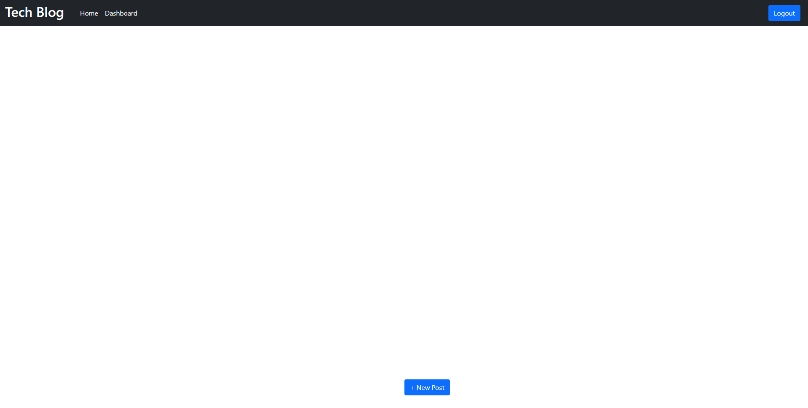
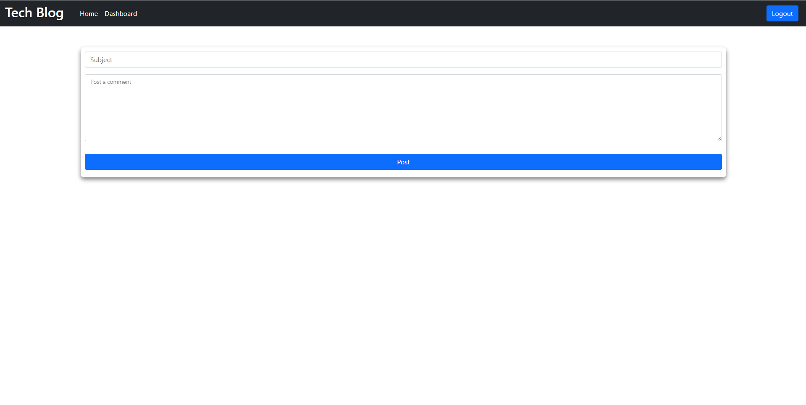

# MVC Tech Blog

## Description
A practice app simulating a tech blog posting webpage was designed following the Model-View-Controller paradigm. Utilizes previously used technologies such as express to handle the back-end as well as using new technologies such as sequelize (to manage the database) and handlebars to handle the front-end. A certain structure is followed to organize the files used throughout the assignment and to help understand how they all work together to deliver the final product.

This project is currently a WIP.

## Installation
Use 'npm i' or 'npm install' commands to install all necessary packages (only necessary for development), otherwise the site can easily be navigated through Heroku.

## Usage
Upon visiting the site, the user must sign-up or login to interact with the webpage's features and to post to the blog. Once a session is made from logging in, the user may view their dashboard (WIP) or make a new post to the blog via the button at the bottom (currently cannot post anything). In the future, the user may add a subject title and add content to their post before submitting it and posting it to the blog. All posts will be recorded and saved in the user's dashboard, where they may edit and update it as needed.

The webpage can be viewed [here](https://thawing-retreat-88962.herokuapp.com/)

## Credits
N/A

## License
N/A